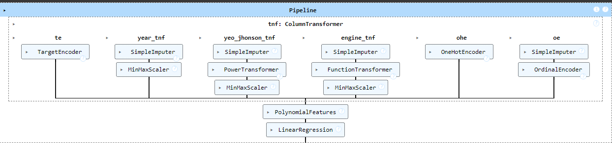

## Resale Price Insights ##

## Ever wondered if there's a smarter way to figure out how much a used car should cost or how much we can make after selling your old car? Well, that's exactly what our project is all about! ##

  

## Problem : ##
  Buying or selling a used car can be confusing because it's hard to know if the price is fair.Buyers might overpay, and sellers might not get what their car is worth. People often rely on guesswork or outdated information, leading to unfair deals. 

## Introduction:  ## 
  Our project aims to solve this problem by using data science and machine learning to predict used car prices accurately. By analyzing factors like age, mileage, and market trends, we want to provide a reliable platform that helps buyers and sellers make informed decisions, making the used car market more transparent and fair for everyone.

App link:  https://resale-price-insight.streamlit.app/

## Pipeline For Model:  ##
 

## Overview of Steps:   ##
1: Historical data of resale prices of cars retrived from Kaggle 
2: Data Cleaning,EDA 
3: Data Preprocessing and Feature Engineering 
4: Model is developed Using LinearRegresion(Polynomial Features) Algorithm 
5: Create Web-App and Deployed using Streamlit 
